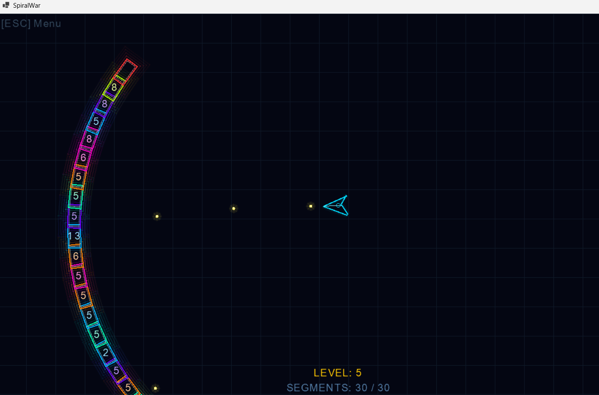

# SpiralWar

SpiralWar is an infinite-level, arcade-style survival shooter built with **C#** and the **MonoGame** framework. Survive against ever-growing, segmented snake-like enemies in a dark, neon-lit grid universe.



## 🌟 Key Features

* **Infinite Level Progression:** As you advance through the levels, the snake segments proportionally scale in count and core health.
* **Dynamic Neon Visuals:** High-fidelity primitive drawing with vibrant, glowing collision effects and a deep grid background.
* **Persistent Save/Load System:** Your level progression is continuously saved, allowing you to easily resume your run from the main menu.
* **Skill & Charge Mechanics:** Destroy enemy segments and gather supplies to accumulate charge for your special skills.
* **Robust Software Architecture:** Built using clean, component-based structures adhering strictly to SOLID, YAGNI, and DRY principles.

## 🛠️ Technologies Used

* **Language:** C#
* **Engine/Framework:** MonoGame
* **Architecture:** Shared Core Library (Cross-platform support for Desktop & Mobile)

## 🚀 Getting Started

1. Clone this repository:
   ```bash
   git clone https://github.com/arargame/SpiralWar.git
   ```
2. Open the `SpiralWar.sln` solution using Visual Studio or JetBrains Rider.
3. Set the `SpiralWar.Desktop` project as the startup project.
4. Build and Run the game to start surviving!

## 🤝 Contribution & Maintenance

This project is meticulously organized where shared logic and game entities reside in the `SpiralWar.Shared` project, with specialized clients branching out. 
